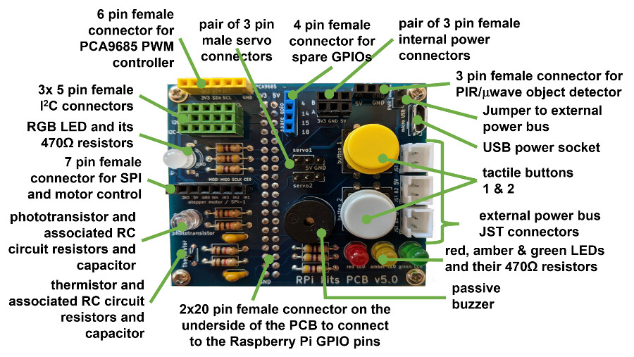
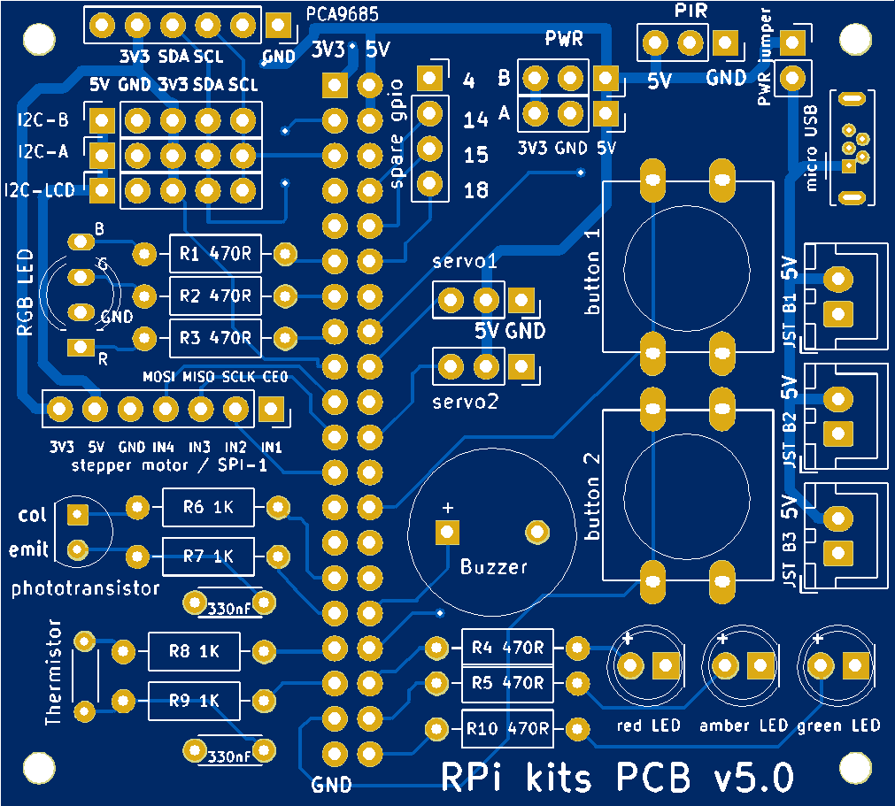
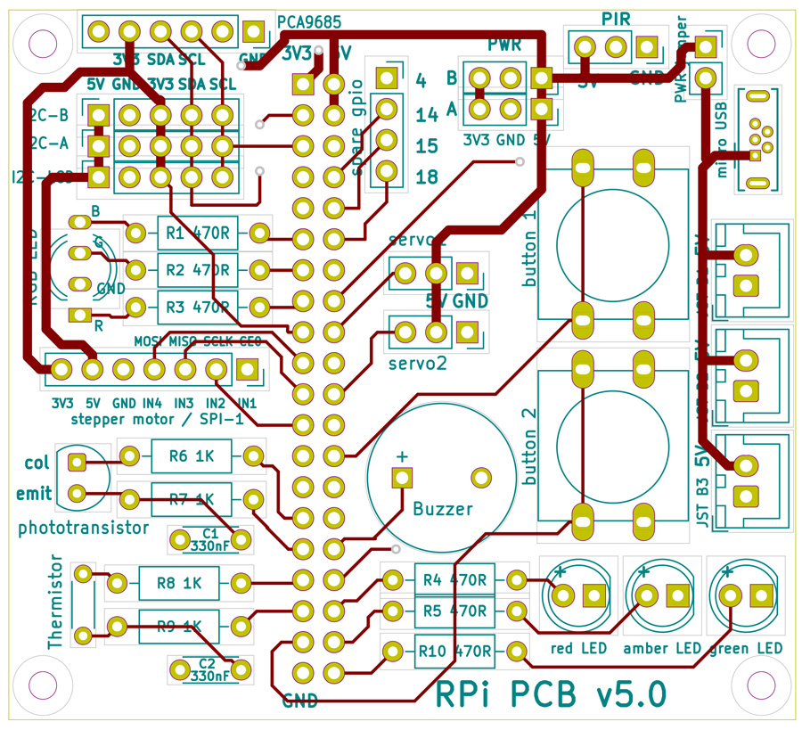
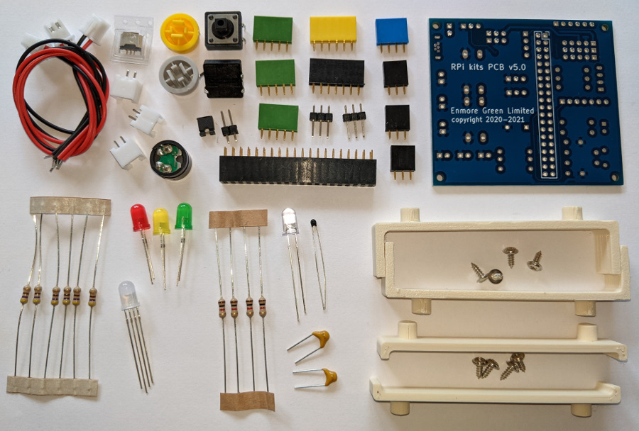

# Raspberry Pi PCB v5.0
## Documentation for usage exploration of:
 - basic electronic functions
 - LCD, OLED and LED displays
 - servo, stepper and drive motor control
 - various sensors
 - 433Mz ASK/OOK RF communications, and 
 - image taking with a USB camera

 &nbsp; &nbsp; 

A robust permanent module, that connects to the Raspberry Pi GPIO pins, can be created by soldering a set of components into a custom Printed Circuit Board (PCB v5.0). The module design, as shown above, includes a number of on-board devices that can be controlled by the Pi (e.g. buzzer, LEDs, etc.), but also allows a wide range of further components to be connected to the PCB enabling more Pi controlled systems to be built and explored.

Full details about the project are published at <a href="https://onlinedevices.org.uk/Raspberry+Pi+Maker+PCB" target="_blank" >this link</a> and the designs for a small number of associated custom 3D printed components can be downloaded from <a href="https://www.prusaprinters.org/prints/68834-raspberry-pi-maker-kit-pcb-stands" target="_blank">here</a>.

## Custom PCB design

The custom PCB (now at v5.0) was designed using KiCAD and the layout has been defined to allow headers and other connectors for all the components needed to build a fully populated module.

 &nbsp; &nbsp;  &nbsp; &nbsp;   

Gerber files for the PCB design can be downloaded from the PCB_design_files folder.

## Raspberry Pi SBC code
The code and documentation has been updated to allow for a generalised username instead of the previous default username 'pi' and an installation script is provided that not only downloads all the code and documentation but also installs all the various libraries/modules needed by the code.

Example code is provided, just for the 'basic electronics' exploration, using the Pi's Scratch offline versions 1.4, 2 and 3, so that all the common Raspberry Pi SBC formats that can run Scratch in some form has an option.

Python example code is provided for all the 'exploration' areas and can usually be run using the Thonny IDE on a Pi SBC, but suggested CLI commands for the 'pi' user are also provided in the code as a comment, where the installed folders are assumed to be: /home/YOURUSERNAME/RPi_maker_kit5/foldername/ where 'foldername' is for one of the specific areas that is being explored, e.g. displays, sensors, etc.

The image taking code also assumes various folders for the storage of different types of 'taken' images and these folders are not always auto-created so the code should be checked so that the appropriate folders can be created before the code is run.

