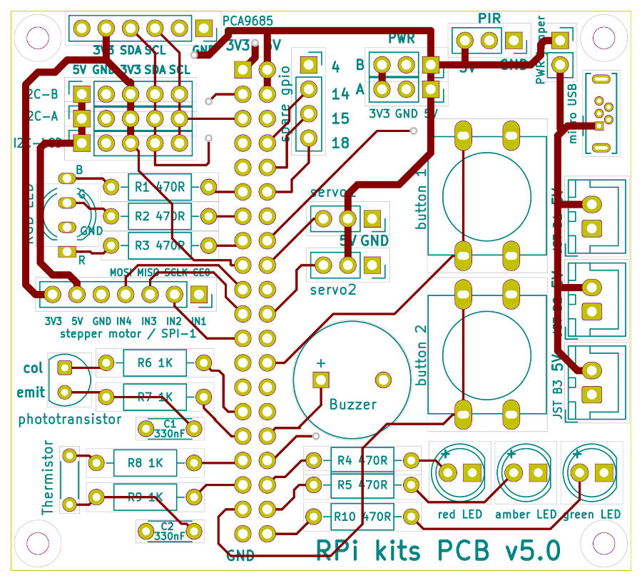

# Raspberry Pi Maker Kit v5.0
## Documentation and example code for usage exploration of:
 - basic electronic functions
 - LCD, OLED and LED displays
 - servo, stepper and drive motor control
 - various sensors, and 
 - image taking with a USB camera

A robust permanent module, that connects to the Raspberry Pi GPIO pins, can be created by soldering a set of components into a custom Printed Circuit Board (PCB v5.0). The module design, as shown above, includes a number of on-board devices that can be controlled by the Pi (e.g. buzzer, LEDs, etc.), but also allows a wide range of further components to be connected to the PCB enabling more Pi controlled systems to be explored.

      

The custom PCB (now at v5.0) was designed using KiCAD and the Kit has been defined to provide all the components needed to build a fully populated module.

Full details about the project are published at <a href="https://onlinedevices.co.uk/Raspberry+Pi+Maker+Kit" target="_blank" >this link</a> and the designs for a small number of associated custom 3D printed components can be downloaded from <a href="https://www.prusaprinters.org/prints/68834-raspberry-pi-maker-kit-pcb-stands" target="_blank">here</a>.

## Raspberry Pi SBC code
Example code is provided for the Pi's Scratch offline versions 1.4, 2 and 3 so that all the common Raspberry Pi SBC formats that can run Scratch in some form has an option.

The provided Python example code can usually be run using the Thonny IDE on a Pi SBC but suggested CLI commands are also provided in the code as a comment where the installed folders are assumed to be:
/home/pi/RPi_maker_kit5/foldername/ where foldername is for one of the specific areas that is being explored, e.g. displays, sensors, etc.

The image taking code also assumes various folders for the storage of different types of 'taken' images and these folders are not always auto-created so the code should be checked so that the appropriate folders can be created before the code is run.
