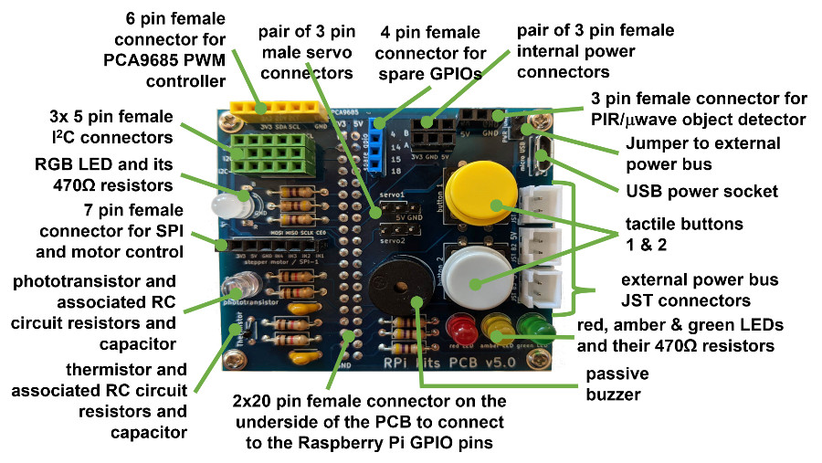
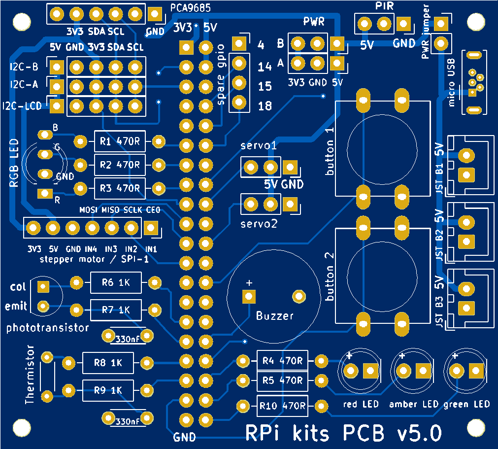
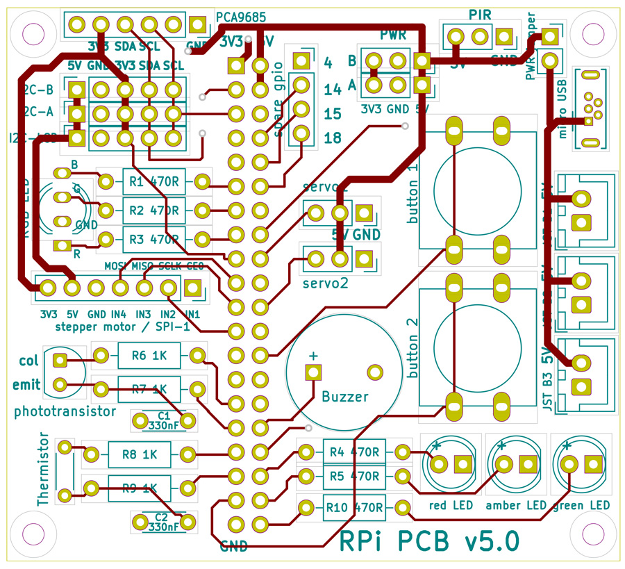
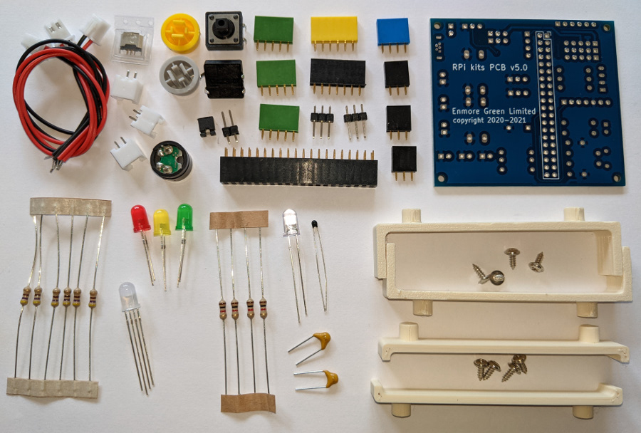

# Raspberry Pi PCB v5.0

The aim of this project was to consolidate a number of components previously used in separate breadboard-based educational projects, along with some additional options, in a more robust, permanent assembly using a custom Printed Circuit Board (PCB). 
This new platform would then allow an even wider range of projects to be developed, but it should be noted that all the various uses profiled here can still be carried out without the use of the custom PCB which just makes the various connections to the Raspberry Pi a lot easier.

Full details about the project are published at <a href="https://onlinedevices.org.uk/Raspberry+Pi+Maker+PCB" target="_blank" >this link</a> and the designs for a small number of associated custom 3D printed components can be downloaded from <a href="https://www.prusaprinters.org/prints/68834-raspberry-pi-maker-PCB-stands" target="_blank">here</a>.

The various sections below provide more detail on:
 - the documentation made available in the 'documentation' folder;
 - the design details for the PCB made available in the 'PCB_design_files' folder; and
 - the software available as downloads from the 'Raspberry_Pi_SBC_code' folder.

## Documentation:

A robust permanent module, that connects to the Raspberry Pi GPIO pins, can be created by soldering a set of components into the custom Printed Circuit Board (PCB v5.0). The module design, as shown below, includes a number of on-board devices that can be controlled by the Pi (e.g. buzzer, LEDs, etc.), but also allows a wide range of further components to be connected to the PCB enabling more Pi controlled systems to be built and explored.

&nbsp; &nbsp; 

Documentation is made available for usage exploration of:
 - basic electronic functions
 - LCD, OLED and LED displays
 - servo, stepper and drive motor control
 - various sensors
 - 433Mz ASK/OOK RF communications, and 
 - image taking with a USB camera

## Custom PCB design

The custom PCB (now at v5.0) was designed using KiCAD and the layout has been defined to allow headers and other connectors for all the components needed to build a fully populated module.

 &nbsp; &nbsp;  &nbsp; &nbsp;   

Gerber files for the PCB design can be downloaded from the PCB_design_files folder.

## Raspberry Pi SBC code
The code and documentation has been updated to allow for a generalised username instead of the previous default username 'pi', and for the use of Python using the Bookworm OS the use of a Virtual Environment is described.

An installation script is also provided that not only downloads all the code and documentation but also installs all the various libraries/modules needed by the code.

Example code is provided, just for the 'basic electronics' exploration, using the Pi's Scratch offline versions 1.4, 2 and 3, so that all the common Raspberry Pi SBC formats that can run Scratch in some form has an option.

Python example code is provided for all the 'exploration' areas and can usually be run using the Thonny IDE on a Pi SBC, but suggested CLI commands for the user are also provided in the code as a comment, where the installed folders are assumed to be: /home/YOURUSERNAME/RPi_maker_PCB5/foldername/ where 'foldername' is for one of the specific areas that is being explored, e.g. displays, sensors, etc.

The image taking code also assumes various folders for the storage of different types of 'taken' images and these folders are not always auto-created so the code should be checked so that the appropriate folders can be created before the code is run.

